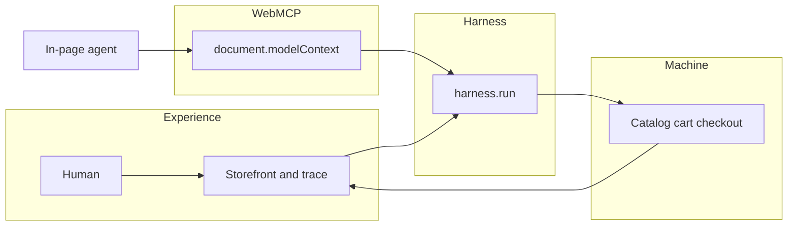

<div align="center">

# ⚡ Olympus MCP Harness

### *The model reasons. WebMCP connects. Olympus controls. The machine executes.*

**WebMCP Challenge · execution control behind the agent-to-web boundary**

<br />

[](https://webmcp.devpost.com/)
[](https://webmcp.devpost.com/)
[](docs/checklist.md)

<br />

[](PROJECT.md)
[](docs/spec.md)
[](https://github.com/Olympusxvn/olympus-mcp-harness)

<br />

[](https://www.typescriptlang.org/)
[](https://nextjs.org/)
[](https://developer.chrome.com/docs/ai/webmcp)
[](https://nodejs.org/)
[](LICENSE)

<br />

> **New here?** WebMCP discovers and connects. Olympus inspects, validates, authorizes, executes, and verifies — and stops the human at checkout.

<br />

```text
USER GOAL → MODEL (reason · plan · decide)
                ↓
         WEBMCP BOUNDARY
     registerTool · discover · invoke
                ↓
      OLYMPUS MCP HARNESS
 Inspect → Validate → Authorize
        → Execute → Verify
        → Trace
                ↓
            MACHINE
```

</div>

---

## 📑 Contents

| | |
|:---|:---|
| ⚖️ | [For judges](#-for-judges--5-min-verify) |
| 🏗️ | [Overview](#-overview) |
| 🔌 | [WebMCP tools](#-webmcp-tools) |
| ⚡ | [Quick start](#-quick-start) |
| 📚 | [Documentation](#-documentation) |
| ✅ | [Checklist](#-checklist) |
| 🔒 | [Security](#-security) |

---

<div align="center">

## ⚖️ For judges — 5 min verify

**No API keys. No real payments. Simulated checkout only.**

Repo stays **private until submission day**, then public for judging.

</div>

```bash
git clone https://github.com/Olympusxvn/olympus-mcp-harness.git
cd olympus-mcp-harness
npm install
npm run dev
# open http://localhost:3000
```

| 🔗 Resource | 📍 Link |
|:------------|:--------|
| **🌐 Live URL** | Added at submit (Vercel HTTPS) |
| **📘 Strategy lock** | [PROJECT.md](PROJECT.md) |
| **📐 Spec** | [docs/spec.md](docs/spec.md) |
| **✅ Build plan** | [docs/checklist.md](docs/checklist.md) |

### Test WebMCP (agent path)

1. **ChatGPT in-app browser** — WebMCP on by default. Open the live URL (or localhost if your client allows it). Goal: *Find the best laptop under $1,500 for AI development and prepare it for purchase.*
2. **Google Chrome 151+** — `chrome://flags/#enable-webmcp-testing` → Enabled → relaunch. Optional: [Model Context Tool Inspector](https://developer.chrome.com/docs/ai/webmcp).
3. **No WebMCP client** — use the **Simulate** controls in the Model column. Same `harness.run` path; do not treat missing `document.modelContext` as a broken app.

### What must be true

- Five tools registered via `document.modelContext.registerTool` (thin wrappers).
- Checkout pauses on **HUMAN APPROVAL REQUIRED**. **Reject** = no order.
- Trace events are real. Metrics are not hardcoded.
- Purchases are **simulated** — no card, no Stripe.

---

## 🏗️ Overview

Olympus MCP Harness is the control layer **behind** the WebMCP boundary. The model decides *what* and *why*. WebMCP is how the agent talks to the web. Olympus answers *can / should / did it work*. The machine does the work.

| Layer | Responsibility |
|:------|:---------------|
| **🧠 Model** | WHAT / WHY — intent, plan, tool choice, interpret results |
| **🔌 WebMCP** | HOW THE AGENT TALKS TO THE WEB — `registerTool`, discover, invoke |
| **🛡️ Olympus** | CAN / SHOULD / DID IT WORK? — inspect, validate, authorize, execute, verify, trace |
| **🖥️ Machine** | DO THE WORK — catalog, cart, simulated checkout |



**Thesis:** Models are probabilistic. Execution shouldn't be.

---

## 🔌 WebMCP tools

Thin `execute` handlers call `harness.run`. Policy lives in the harness, not in the tool wrapper.

| Tool | Risk | Auto | Human approval | Retry |
|:-----|:-----|:----:|:--------------:|:-----:|
| `search_products` | Low | Yes | No | Yes (timeout) |
| `get_product` | Low | Yes | No | Yes |
| `compare_products` | Low | Yes | No | Yes |
| `add_to_cart` | Medium | Yes | No | No |
| `checkout` | High | No | **Yes** | No |

Demo goal: *Find the best laptop under $1,500 for AI development and prepare it for purchase.*

---

## ⚡ Quick start

**Judge / local**

```bash
npm install
npm run dev
```

Open [http://localhost:3000](http://localhost:3000). Node 20+.

**Chrome flag**

```text
chrome://flags/#enable-webmcp-testing
```

Set **Enabled**, relaunch Chrome.

**Scripts**

| Script | Purpose |
|:-------|:--------|
| `npm run dev` | Next.js dev server |
| `npm run build` | Production build |
| `npm run start` | Serve production build |
| `npm run lint` | ESLint |
| `npm test` | Vitest harness tests |

---

## 📚 Documentation

| 📄 Document | 🎯 Purpose |
|:------------|:-----------|
| [PROJECT.md](PROJECT.md) | Strategy lock, demo script, definition of done |
| [docs/scope.md](docs/scope.md) | Idea, cuts, challenge fit |
| [docs/prd.md](docs/prd.md) | Stories and acceptance |
| [docs/spec.md](docs/spec.md) | Architecture and file tree |
| [docs/checklist.md](docs/checklist.md) | Sequenced build |
| [docs/learner-profile.md](docs/learner-profile.md) | Hackathon learner profile |
| [process-notes.md](process-notes.md) | Decision log |
| [LICENSE](LICENSE) | MIT |

<details>
<summary><strong>🔗 References</strong></summary>

| Resource | URL |
|:---------|:----|
| The WebMCP Challenge | https://webmcp.devpost.com/ |
| Challenge resources | https://webmcp.devpost.com/resources |
| WebMCP specification | https://github.com/webmachinelearning/webmcp |
| Chrome WebMCP docs | https://developer.chrome.com/docs/ai/webmcp |
| Imperative API | https://developer.chrome.com/docs/ai/webmcp/imperative-api |
| Best practices | https://developer.chrome.com/docs/ai/webmcp/best-practices |
| `webmcp-types` | https://www.npmjs.com/package/webmcp-types |

</details>

---

## ✅ Checklist

Hackathon definition of done lives in [PROJECT.md](PROJECT.md) §23. Build sequence: [docs/checklist.md](docs/checklist.md).

- [x] Public-ready MIT license in repo
- [ ] Five WebMCP tools on the live page
- [ ] Checkout approval bound to exact arguments
- [ ] Trace + honest metrics
- [ ] One safe failure path
- [ ] Vercel live URL
- [ ] Demo video &lt; 3 minutes
- [ ] Repo **public** at submit (kept private until then)

---

## 🔒 Security

- Validate all tool inputs in the harness. Do not trust model-supplied values blindly.
- Never execute high-risk actions without explicit human approval.
- Bind approval to exact arguments; changed cart/total invalidates the token.
- Do not auto-retry checkout.
- No secrets in traces. Demo commerce is sandboxed — **no real charges**.

---

<div align="center">

**Olympus MCP Harness**

*The model reasons. WebMCP connects. Olympus controls. The machine executes.*

[](https://github.com/Olympusxvn/olympus-mcp-harness/stargazers)

MIT License · [Olympusxvn](https://github.com/Olympusxvn)

</div>
