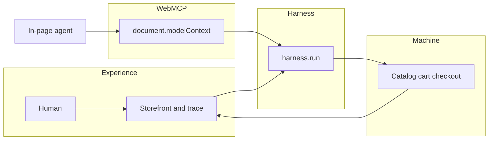

<div align="center">

# ⚡ Olympus MCP Harness

### *The model reasons. WebMCP connects. Olympus controls. The machine executes.*

**WebMCP Challenge · execution control behind the agent-to-web boundary**

<br />

[](https://webmcp.devpost.com/)
[](https://webmcp.devpost.com/)
[](https://webmcp.devpost.com/)

<br />

[](PROJECT.md)
[](docs/spec.md)
[](https://olympus-mcp-harness.vercel.app)
[](https://github.com/Olympusxvn/olympus-mcp-harness)

<br />

[](https://www.typescriptlang.org/)
[](https://nextjs.org/)
[](https://developer.chrome.com/docs/ai/webmcp)
[](https://nodejs.org/)
[](LICENSE)

<br />

> Judges: See the [2–3 minute testing guide](./JUDGE_TESTING.md) for quick verification in ChatGPT or Codex.
> 
> **For developers exposing real actions to AI agents through WebMCP.**
>
> WebMCP makes actions available to models. Olympus makes those actions safe to execute.
>
> As WebMCP moves agents from reading websites to acting on them, execution becomes a trust boundary. Olympus engineers that boundary.
>
> **WebMCP structures the action. Olympus governs the execution.**
>
> Olympus enables **controlled delegation**: agents handle routine actions autonomously while humans retain control over consequential ones.
> 
> High-risk actions stay behind explicit human approval.

<br />

```text
USER GOAL
   ↓
MODEL
reason · plan · decide
   ↓
WEBMCP
registerTool · discover · invoke
   ↓
OLYMPUS MCP HARNESS
Inspect → Validate → Authorize → Execute → Verify
                         ↘ Recover on safe failure
   ↓
MACHINE
App Logic · APIs · State
   ↓
STRUCTURED RESULT
   └────────→ MODEL

Trace · Metrics · Audit across the full execution path
```

</div>

---

## 📑 Contents

| | |
|:---|:---|
| ⚖️ | [For judges](#-for-judges--5-min-verify) |
| 🏗️ | [Overview](#-overview) |
| 🔌 | [WebMCP tools](#-webmcp-tools) |
| ⚡ | [Quick start](#-quick-start) |
| 🧪 | [Testing](#-testing) |
| 📚 | [Documentation](#-documentation) |
| ✅ | [Checklist](#-checklist) |
| 🔒 | [Security](#-security) |

---

<div align="center">

## ⚖️ For judges — 5 min verify

**No API keys. No real payments. Simulated checkout only.**

Repo is **public** (MIT). No API keys. No real payments. Simulated checkout only.

</div>

```bash
git clone https://github.com/Olympusxvn/olympus-mcp-harness.git
cd olympus-mcp-harness
npm install
npm test
npm run build
npm run dev
# open http://localhost:3000
```

| 🔗 Resource | 📍 Link |
|:------------|:--------|
| **🌐 Live URL** | [https://olympus-mcp-harness.vercel.app](https://olympus-mcp-harness.vercel.app) |
| **📘 Strategy lock** | [PROJECT.md](PROJECT.md) |
| **📐 Spec** | [docs/spec.md](docs/spec.md) |
| **✅ Build plan** | [docs/checklist.md](docs/checklist.md) |

### Test WebMCP (agent path)

1. **ChatGPT in-app browser** — WebMCP on by default. Open the live URL (or localhost if your client allows it). Goal: *Find the best laptop under $1,500 for AI development and prepare it for purchase.*
2. **Google Chrome 149+** — `chrome://flags/#enable-webmcp-testing` → Enabled → relaunch. Optional: [Model Context Tool Inspector](https://developer.chrome.com/docs/ai/webmcp).
3. **No WebMCP client** — use the **Simulate** controls in the Model column. Same `harness.run` path; do not treat missing `document.modelContext` as a broken app.

### Native ChatGPT WebMCP test

Olympus was tested directly in ChatGPT's in-app browser.
ChatGPT successfully discovered and invoked these WebMCP tools natively:
- `search_products`
- `get_product`
- `compare_products`
- `add_to_cart`
For the high-risk `checkout` tool, ChatGPT's browser security blocked the invocation before it reached Olympus's own approval layer:
  Auto-review denied permission
Cloud browser cannot use this WebMCP tool for checkout

```
  ChatGPT Agent
    ↓
ChatGPT Browser Security
    ↓
WebMCP
    ↓
Olympus MCP Harness
    ↓
Human Approval
    ↓
Machine
```
Low- and medium-risk actions reached Olympus successfully.
High-risk checkout was independently blocked at the client security layer.
This is expected defense-in-depth behavior.


### What must be true
- Five tools registered via `document.modelContext.registerTool` (thin wrappers).
- When the WebMCP client permits checkout invocation, Olympus pauses on HUMAN APPROVAL REQUIRED. In ChatGPT's in-app browser, checkout may be blocked earlier by client security.
- Trace events are real. Metrics are not hardcoded.
- Purchases are **simulated** — no card, no Stripe.
- Safe failure is one click: **Invalid search** (`INVALID_INPUT`) and **Timeout then recover** (low-risk retry once). Cart stays put. Checkout still never auto-retries.

---

## 🏗️ Overview

Olympus MCP Harness is for **developers exposing real actions to AI agents through WebMCP**. It is the control layer **behind** the WebMCP boundary — not another agent.

WebMCP makes actions available to models. Olympus makes those actions safe to execute.

As WebMCP moves agents from reading websites to acting on them, execution becomes a trust boundary. Olympus engineers that boundary.

The model decides *what* and *why*. WebMCP is how the agent talks to the web. Olympus answers *can / should / did it work*. The machine does the work.

The laptop storefront is a **demo machine**. The harness API is generic: register a tool, attach policy metadata, then run it.

Olympus runs behind WebMCP site tools inside the live browser context, preserving the page’s existing state and user experience while adding execution policy, verification, and traceability.

This keeps the human interface in the loop while giving agents a structured path to act on the same application state.

WebMCP is page-level and session-aware; MCP is backend-oriented. Olympus is intentionally built behind the WebMCP page boundary, not as a replacement for MCP.

### Controlled delegation

Olympus explores a WebMCP interaction model where agents can autonomously perform low-risk actions while high-risk actions remain behind explicit human approval.

The goal is not full autonomy and not manual browsing — it is controlled delegation.

```ts
await harness.run("tool_name", input);

getPolicy("tool_name");
// { risk: "low" | "medium" | "high",
//   requiresApproval: boolean,
//   retryOnTimeout: boolean }
```

Shopping is one binding of that table (`checkout` = high + approval, no retry). Another site would register different tools against the same `harness.run`.

| Layer | Responsibility |
|:------|:---------------|
| **🧠 Model** | WHAT / WHY — intent, plan, tool choice, interpret results |
| **🔌 WebMCP** | HOW THE AGENT TALKS TO THE WEB — `registerTool`, discover, invoke |
| **🛡️ Olympus** | CAN / SHOULD / DID IT WORK? — inspect, validate, authorize, execute, verify, trace |
| **🖥️ Machine** | DO THE WORK — catalog, cart, simulated checkout |



**Thesis:** Models are probabilistic. Execution shouldn't be.

---

## 🔌 WebMCP tools

> The future isn’t just better models. It’s better AI systems.🚀
>
> Olympus focuses on the system boundary where model reasoning becomes machine execution.

Thin `execute` handlers call `harness.run`. Policy lives in the harness, not in the tool wrapper.

| Tool | Risk | Auto | Human approval | Retry |
|:-----|:-----|:----:|:--------------:|:-----:|
| `search_products` | Low | Yes | No | Yes (timeout) |
| `get_product` | Low | Yes | No | Yes |
| `compare_products` | Low | Yes | No | Yes |
| `add_to_cart` | Medium | Yes | No | No |
| `checkout` | High | No | **Yes** | No |

Demo goal: *Find the best laptop under $1,500 for AI development and prepare it for purchase.*

---

## ⚡ Quick start

**Judge / local**

```bash
npm install
npm test
npm run build
npm run dev
```

Open [http://localhost:3000](http://localhost:3000). Node 20+.

**Chrome flag**

```text
chrome://flags/#enable-webmcp-testing
```

Set **Enabled**, relaunch Chrome.

**Scripts**

| Script | Purpose |
|:-------|:--------|
| `npm run dev` | Next.js dev server |
| `npm run build` | Production build |
| `npm run start` | Serve production build |
| `npm run lint` | ESLint |
| `npm test` | Vitest harness tests |

---

## 🧪 Testing

Clone-from-zero verify (same as the checklist):

```bash
npm i && npm test && npm run build
```

Coverage includes invalid search, approval reject, verification fail, low-risk timeout retry, and **no auto-retry on checkout**.

Live metrics fold from the in-session trace (never a hardcoded percentage). Chrome WebMCP Evals methodology is **planned** — this README does not claim an eval score until a run exists.

---

## 📚 Documentation

| 📄 Document | 🎯 Purpose |
|:------------|:-----------|
| [PROJECT.md](PROJECT.md) | Strategy lock, demo script, definition of done |
| [docs/scope.md](docs/scope.md) | Idea, cuts, challenge fit |
| [docs/prd.md](docs/prd.md) | Stories and acceptance |
| [docs/spec.md](docs/spec.md) | Architecture and file tree |
| [docs/checklist.md](docs/checklist.md) | Sequenced build |
| [docs/devpost.md](docs/devpost.md) | Devpost copy archive |
| [docs/learner-profile.md](docs/learner-profile.md) | Hackathon learner profile |
| [process-notes.md](process-notes.md) | Decision log |
| [LICENSE](LICENSE) | MIT |

<details>
<summary><strong>🔗 References</strong></summary>

| Resource | URL |
|:---------|:----|
| The WebMCP Challenge | https://webmcp.devpost.com/ |
| Challenge resources | https://webmcp.devpost.com/resources |
| WebMCP specification | https://github.com/webmachinelearning/webmcp |
| Chrome WebMCP docs | https://developer.chrome.com/docs/ai/webmcp |
| Imperative API | https://developer.chrome.com/docs/ai/webmcp/imperative-api |
| Best practices | https://developer.chrome.com/docs/ai/webmcp/best-practices |
| `webmcp-types` | https://www.npmjs.com/package/webmcp-types |

</details>

---

## ✅ Checklist

Hackathon definition of done lives in [PROJECT.md](PROJECT.md) §23. Build sequence: [docs/checklist.md](docs/checklist.md).

- [x] Public-ready MIT license in repo
- [x] Checkout approval bound to exact arguments
- [x] Trace + honest metrics
- [x] One safe failure path
- [x] Vercel live URL — [olympus-mcp-harness.vercel.app](https://olympus-mcp-harness.vercel.app)
- [x] Five WebMCP tools listed (Chrome 149+ flag on / ChatGPT in-app browser)
- [x] Demo video &lt; 3 minutes (on Devpost)
- [x] Repo **public** (MIT) — [Olympusxvn/olympus-mcp-harness](https://github.com/Olympusxvn/olympus-mcp-harness)
- [x] Submitted to [The WebMCP Challenge](https://webmcp.devpost.com/)

---

## 🔒 Security

- Validate all tool inputs in the harness. Do not trust model-supplied values blindly.
- Never execute high-risk actions without explicit human approval.
- Bind approval to exact arguments; changed cart/total invalidates the token.
- Do not auto-retry checkout.
- No secrets in traces. Demo commerce is sandboxed — **no real charges**.

---

<div align="center">

**Olympus MCP Harness**

*The model reasons. WebMCP connects. Olympus controls. The machine executes.*

[](https://github.com/Olympusxvn/olympus-mcp-harness/stargazers)

MIT License · [Olympusxvn](https://github.com/Olympusxvn)

</div>
