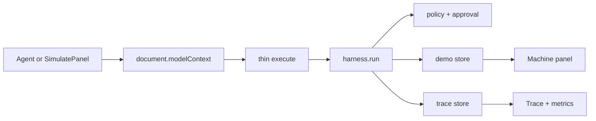

# Olympus MCP Harness — Technical Spec

## Stack
- **Language:** TypeScript (strict).
- **App:** Next.js App Router (current stable), React, Tailwind CSS.
- **Fonts:** Sora (`luxe-display`) + Inter via `next/font/google`.
- **Validation:** Zod inside the harness; JSON Schema objects on `registerTool` (`inputSchema`).
- **WebMCP:** Imperative API on `document.modelContext.registerTool`. Types: [`webmcp-types`](https://www.npmjs.com/package/webmcp-types) (`compilerOptions.types`). Do not use Node MCP SDK / stdio servers.
- **State:** Module-level in-memory stores (catalog, cart, traces, pending approval). No DB in MVP.
- **Tests:** Vitest for harness unit/integration (validator, policy, approval binding, verifier, error codes).
- **Deploy:** Vercel. Client-only tool registration ( `'use client'` ).

Rationale: locked in `PROJECT.md` + learner profile. Luxury UI from `luxury-wc-ui`, not the blue/purple/green dashboard in `PROJECT.md` §13.

Docs:
- [Next.js](https://nextjs.org/docs)
- [Chrome WebMCP](https://developer.chrome.com/docs/ai/webmcp)
- [Imperative API](https://developer.chrome.com/docs/ai/webmcp/imperative-api)
- [Best practices](https://developer.chrome.com/docs/ai/webmcp/best-practices)
- [webmcp-types](https://www.npmjs.com/package/webmcp-types)
- [Zod](https://zod.dev)

## Runtime & Deployment
- **Runtime:** Browser page. Harness runs in the same JS heap as the storefront so cart, approval, and traces share state with tools.
- **Target browsers:** ChatGPT in-app browser (WebMCP on by default); Google Chrome 151+ with `chrome://flags/#enable-webmcp-testing`.
- **HTTPS:** required for WebMCP (secure context). Local: `next dev`. Prod: Vercel HTTPS.
- **Env:** no secrets required for MVP. Optional later: analytics.
- **Node:** 20+ for local/CI.

```ts
const ctx = document.modelContext;
if (ctx && "registerTool" in ctx) {
  await ctx.registerTool(def, { signal });
}
```

Unregister via `AbortController.abort()` on unmount (Chrome docs; as of 153 in-flight executes are not cancelled by unregister).

`execute(input, { signal })` must honor abort for timeouts.

## Architecture Overview

```text
USER GOAL
   ↓
MODEL                 Reason · Plan · Decide
   ↓
WEBMCP BOUNDARY       registerTool · discover · invoke
   ↓
OLYMPUS MCP HARNESS   Inspect → Validate → Authorize
                      → Execute → Verify → Trace
   ↓
MACHINE               App · APIs · DB · State
   ↓
STRUCTURED RESULT     → model + UI panels
```



No server actions for tool execution. Optional `app/api` only if Vercel needs a health route — not on the critical path.

Implements `prd.md > Catalog & agent tools`, `Cart mutation`, `High-risk checkout`, `Harness pipeline`.

## Luxury shell
### Tokens and utilities
Copy CSS variables and `.luxe-*` from `luxury-wc-ui` reference (`~/.cursor/skills/luxury-wc-ui/reference.md`). Classes: `luxe-display`, `luxe-eyebrow`, `luxe-gold-text`, `luxe-hairline`, `luxe-glass`, `luxe-glass-strong`, `btn-luxe`, `btn-luxe-ghost`, `luxe-chip`, `luxe-navlink`. Honor `prefers-reduced-motion` and `prefers-reduced-transparency`.

PRD ref: `prd.md > First impression & thesis`

### Layout components
- `LuxuryNav` — brand **Olympus MCP Harness**, links: Demo / Trace (anchors ok).
- `HarnessBackground` — full-bleed dark texture or restrained hero image + light edge scrim (not a World Cup stadium; no blurred dim overlay).
- Three `luxe-glass` columns: Model, Harness, Machine.
- `ApprovalDialog` — full-viewport gold-border modal, highest z-index.
- Stage chips: gold = running/success, champagne = approval wait, deep red = error. Labels always present (color is not the only channel).

## WebMCP registration
### Capability probe
`lib/webmcp/detect.ts` — `{ supported: boolean }`. Drive banner.

### Tool wrappers
`lib/webmcp/registerTools.ts` — register the five tools on mount; abort on unmount. Each `execute`:

1. `const result = await harness.run(name, input, { signal })`
2. Return a value agents can read: JSON string of the envelope **plus** a one-line `message` field. Do not return harness internals (stack traces, secrets).

`annotations`: `readOnlyHint: true` on search/get/compare; `false` on add_to_cart/checkout.

### Schemas
`lib/webmcp/toolSchemas.ts` — JSON Schema for `inputSchema`, kept in sync with Zod in `lib/harness/validator.ts`.

PRD ref: `prd.md > Catalog & agent tools`

## Harness runtime
### Types
`lib/harness/types.ts` — `RiskLevel`, `HarnessTool`, `HarnessContext`, `HarnessResult`, `HarnessError`, `TraceEvent`, `VerificationResult` as in `PROJECT.md` §9–12.

### Registry
`lib/harness/registry.ts` — name → tool. Unknown name → `TOOL_NOT_FOUND`.

### Validator
`lib/harness/validator.ts` — Zod parse + light normalize (trim query, coerce qty to int). Fail → `INVALID_INPUT`, retryable false.

### Policy
`lib/harness/policy.ts` — table:

| Tool | Risk | Auto | Approval | Retry |
|---|---|---|---|---|
| search_products | low | yes | no | yes (1× timeout) |
| get_product | low | yes | no | yes |
| compare_products | low | yes | no | yes |
| add_to_cart | medium | yes | no | no |
| checkout | high | no | yes | no |

### Approval
`lib/harness/approval.ts` — pending token: `traceId`, tool, canonical JSON of args, amount. `requestApproval` pauses `harness.run` (Promise) until UI Approve/Reject. Changed args → invalidate. Checkout never proceeds without a matching token.

PRD ref: `prd.md > High-risk checkout & human approval`

### Executor
`lib/harness/executor.ts` — `Promise.race` vs timeout (e.g. 4s). Pass `AbortSignal`. Map throw → `EXECUTION_FAILED`. Timeout → `EXECUTION_TIMEOUT`.

### Verifier
`lib/harness/verifier.ts` — per-tool checks from `PROJECT.md` §11 (array + fields + numeric prices; cart qty/total; order id + amount match). Fail → `VERIFICATION_FAILED`, `ok: false`.

### Trace
`lib/harness/trace.ts` — append-only events; `traceId` shared across stages of one run.

### Runtime facade
`lib/harness/runtime.ts` — `run(tool, input, ctx)` implements the pipeline in `PROJECT.md` §9.3. Emits inspect (resolve a WebMCP-exposed capability + risk metadata), validate, authorize, approval, execute, verify, complete. Does not rediscover the WebMCP catalog.

PRD ref: `prd.md > Harness pipeline & observability`

## Demo machine
### Catalog
`lib/demo/products.ts` — 8–12 laptops. At least three under $1500 with AI-dev-ish specs (RAM/GPU in the blurb). Prices numeric.

### Cart & checkout
`lib/demo/cart.ts`, `lib/demo/checkout.ts` — in-memory. Checkout creates `{ orderId, amount, status: "success" }` only after harness approval. Copy: simulated.

PRD ref: `prd.md > Cart mutation`

## Simulate agent (Model panel)
`components/ModelPanel.tsx` — canned goal text, buttons or a small form to fire the five tools with sample payloads, last model “decision” string (what the human/simulate chose, not an LLM). Optional tiny scripted demo: search → compare → add → checkout. Same `harness.run` as WebMCP.

This is required for Execution when judges skip the ChatGPT browser.

## Data Model

### Product
`id: string`, `name: string`, `price: number`, `blurb: string`, `attrs: Record<string, string>`

### Cart
`lines: { productId, qty, unitPrice }[]`, `total: number` (derived)

### Order
`orderId: string`, `amount: number`, `status: "success"`, `createdAt: number`

### PendingApproval
`id: string`, `tool: "checkout"`, `argsCanonical: string`, `amount: number`, `createdAt: number`

### TraceEvent
As `PROJECT.md` §12. Store: `events: TraceEvent[]`. Metrics derived by fold, never hardcoded.

## File Structure

```
olympus-mcp-harness/
├── app/
│   ├── layout.tsx          # fonts, dark, skip Walrus copy
│   ├── globals.css         # luxury tokens + luxe utilities
│   ├── page.tsx            # demo shell
│   └── providers.tsx       # optional React context for stores
├── components/
│   ├── luxury/
│   │   ├── LuxuryNav.tsx
│   │   └── HarnessBackground.tsx
│   ├── ModelPanel.tsx
│   ├── HarnessPanel.tsx    # current stage
│   ├── MachinePanel.tsx    # catalog, cart, receipt
│   ├── TraceTimeline.tsx
│   ├── ApprovalDialog.tsx
│   ├── MetricsPanel.tsx
│   └── WebmcpStatus.tsx
├── lib/
│   ├── webmcp/
│   │   ├── detect.ts
│   │   ├── registerTools.ts
│   │   └── toolSchemas.ts
│   ├── harness/
│   │   ├── types.ts
│   │   ├── errors.ts
│   │   ├── registry.ts
│   │   ├── validator.ts
│   │   ├── policy.ts
│   │   ├── approval.ts
│   │   ├── executor.ts
│   │   ├── verifier.ts
│   │   ├── trace.ts
│   │   └── runtime.ts
│   └── demo/
│       ├── products.ts
│       ├── cart.ts
│       └── checkout.ts
├── tests/
│   └── harness/
│       ├── validator.test.ts
│       ├── policy.test.ts
│       ├── approval.test.ts
│       └── pipeline.test.ts
├── docs/                   # hackathon artifacts
├── public/                 # background asset if needed
├── PROJECT.md
├── process-notes.md
├── README.md
├── LICENSE
├── package.json
├── tailwind.config.ts
├── tsconfig.json           # types: ["webmcp-types"]
└── vitest.config.ts
```

## Key Technical Decisions
1. **Harness in the client, not a server MCP.** WebMCP tools run in the page; a backend MCP would disintermediate the UI the challenge wants to keep. Tradeoff: refresh wipes cart/traces.
2. **Thin `registerTool` + `harness.run`.** Policy lives in one place so agents and Simulate panel cannot bypass approval. Tradeoff: slightly more indirection.
3. **Luxury gold/glass instead of RGB stage colors.** Learner override. Tradeoff: must keep labels + approval modal so color-blind / gold-on-black still works.
4. **In-memory + simulated checkout.** Meets security/demo-safety in `PROJECT.md` §19. Tradeoff: no multi-device persistence.

## Dependencies & External Services
- npm: `next`, `react`, `zod`, `webmcp-types` (dev), Tailwind, Vitest.
- Hosting: Vercel free tier. [Vercel docs](https://vercel.com/docs).
- No paid APIs. No OpenAI key required for the site (agent is the judge’s ChatGPT).
- Chrome Inspector extension for local tool debug.

## Open Issues
- Confirm ChatGPT Sites vs Vercel: learner profile says Vercel. If Sites is needed later, same static client should port.
- `use-webmcp-tool` vs raw register: **raw + AbortSignal** to stay aligned with Chrome imperative docs and `PROJECT.md`. Revisit only if React Strict Mode double-mount causes duplicate tools.
- Rate limit: optional in-memory token bucket; if skipped, still reserve `RATE_LIMITED` in the error union for tests.
